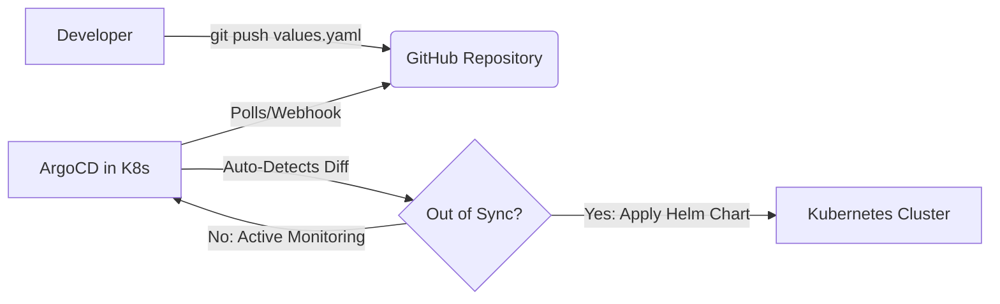

# Learn Helm & ArgoCD GitOps Deployment Pipeline

Welcome! This repository is designed to help you learn **Helm** (the Kubernetes package manager) and **ArgoCD** (the declarative GitOps continuous delivery tool) by deploying a modern web application using a complete GitOps pipeline.

You can run this tutorial **fully online** using a browser-based Kubernetes playground (like **Killercoda**), or locally on your machine.

---

## Architecture Overview

In a GitOps pipeline:
1. **Helm** defines *how* the application is packaged and parameterized (using templates and `values.yaml`).
2. **Git** (GitHub) acts as the **Single Source of Truth** for the desired state of your infrastructure.
3. **ArgoCD** is an agent running in your Kubernetes cluster that continuously monitors your Git repository, compares the desired state in Git with the live state in the cluster, and automatically synchronizes them.



---

## 🛠️ Step 1: Set Up Your Kubernetes Cluster

Choose one of the two options below:

### Option A: Use a Free Online Playground (Recommended)
1. Go to [Killercoda Kubernetes Playground](https://killercoda.com/playgrounds/scenario/kubernetes).
2. Click **Start** to spawn a fresh, fully interactive, multi-node Kubernetes cluster directly in your browser. (It takes less than 10 seconds and is completely free!).
3. Helm and `kubectl` are already pre-installed.

### Option B: Use a Local Kubernetes Cluster
If you prefer running it locally, make sure you have:
*   [Docker Desktop](https://www.docker.com/products/docker-desktop/) installed.
*   [Minikube](https://minikube.sigs.k8s.k8s.io/docs/start/) or [Kind](https://kind.sigs.k8s.io/) installed.
*   Start your local cluster:
    ```bash
    minikube start --driver=docker
    ```

---

## 📦 Step 2: Push This Template to Your GitHub
Because ArgoCD fetches manifests from a Git repository, you need to push these files to a public repository under your own GitHub account.

1. Create a new repository on GitHub named `helm-argocd-pipeline`.
2. Initialize this local directory, commit the files, and push to GitHub:
   ```bash
   cd helm-argocd-pipeline
   git init
   git add .
   git commit -m "feat: initial commit of helm chart and argocd application"
   git branch -M main
   git remote add origin https://github.com/<your-github-username>/helm-argocd-pipeline.git
   git push -u origin main
   ```

---

## ⛵ Step 3: Install ArgoCD in the Cluster

Run these commands in your Kubernetes environment (either your Killercoda terminal or local terminal):

1. **Create the `argocd` namespace:**
   ```bash
   kubectl create namespace argocd
   ```

2. **Install ArgoCD:**
   ```bash
   kubectl apply -n argocd -f https://raw.githubusercontent.com/argoproj/argo-cd/stable/manifests/install.yaml
   ```

3. **Verify the installation:**
   Wait until all pods are in a `Running` state:
   ```bash
   kubectl get pods -n argocd -w
   ```
   *(Press `Ctrl+C` to exit the watch mode once all are ready).*

---

## 🚀 Step 4: Deploy the App via ArgoCD

Now, we'll deploy our application by pointing ArgoCD to your GitHub repository.

1. Open `argocd/application.yaml` in your local editor.
2. Edit the **`repoURL`** field to match your GitHub repository URL:
   ```yaml
   repoURL: 'https://github.com/<your-github-username>/helm-argocd-pipeline.git'
   ```
3. Commit and push this change to your GitHub repo:
   ```bash
   git add argocd/application.yaml
   git commit -m "chore: update repository URL to my github"
   git push origin main
   ```
4. From your cluster terminal, apply the ArgoCD Application manifest:
   ```bash
   kubectl apply -f https://raw.githubusercontent.com/<your-github-username>/helm-argocd-pipeline/main/argocd/application.yaml
   ```

---

## 🔍 Step 5: Verify the Deployment and Access the UI

### 1. View the Resources Created by ArgoCD
ArgoCD will automatically create a namespace called `hello-kubernetes-ns` and deploy the pods, services, and configs defined in your Helm chart.
```bash
kubectl get all -n hello-kubernetes-ns
```

### 2. Access the ArgoCD Dashboard
By default, the ArgoCD API server is not exposed with an external IP. You can access it using Port-Forwarding:
```bash
kubectl port-forward svc/argocd-server -n argocd 8080:443
```
*   **For local machine:** Open [https://localhost:8080](https://localhost:8080) in your browser. (Accept the self-signed certificate warning).
*   **For Killercoda:** Click the **Traffic / Ports** tab in the top menu of Killercoda, and select port `8080` (or type `8080` and click "Access").

**Log in credentials:**
*   **Username:** `admin`
*   **Password:** Fetch the auto-generated password with this command:
    ```bash
    kubectl -n argocd get secret argocd-initial-admin-secret -o jsonpath="{.data.password}" | base64 -d; echo
    ```

---

## ✨ Step 6: Witness the GitOps Magic!

Let's change the color of our web page directly by editing our Helm values in Git.

1. Open your GitHub repository in your web browser or edit locally.
2. Open `hello-kubernetes/values.yaml` and change `config.uiColor` to a different hex color (e.g., `#e74c3c` for Red or `#9b59b6` for Purple).
3. Commit the change directly to the `main` branch.
4. Go to your ArgoCD dashboard. You will see that ArgoCD detects the change (usually within 3 minutes, or you can click the **Sync** or **Refresh** button on the dashboard to trigger it immediately).
5. Watch ArgoCD perform a rolling update of your pods automatically!

---

## 📋 Local Cluster Restart & Port Cheat Sheet

Use these commands whenever you restart your Mac or restart Minikube to keep your browser bookmarks working on the exact same ports:

### 1. Start the Cluster
```bash
minikube start --cpus=4 --memory=6144 --driver=docker
```

### 2. Expose the Dashboards (Open in separate terminal tabs)

* **ArgoCD Dashboard** ➔ Opens at **[https://localhost:8080](https://localhost:8080)**:
  ```bash
  kubectl port-forward svc/argocd-server -n argocd 8080:443
  ```
  
* **Jenkins Dashboard** ➔ Opens at **[http://localhost:8082](http://localhost:8082)**:
  ```bash
  kubectl port-forward svc/jenkins -n jenkins 8082:8080
  ```

### 3. Expose Your Custom Web App
Since our web app is configured to use a **static NodePort (32000)**, you can access it directly without port forwarding!

1. Fetch your Minikube IP:
   ```bash
   minikube ip
   ```
2. Open your bookmark to:
   👉 **`http://<minikube-ip>:32000`** (e.g. `http://192.168.49.2:32000`)

*(If you still prefer using a localhost address at port `8081`, run this port-forward command instead)*:
```bash
kubectl port-forward svc/hello-kubernetes-gitops -n hello-kubernetes-ns 8081:8080
```

